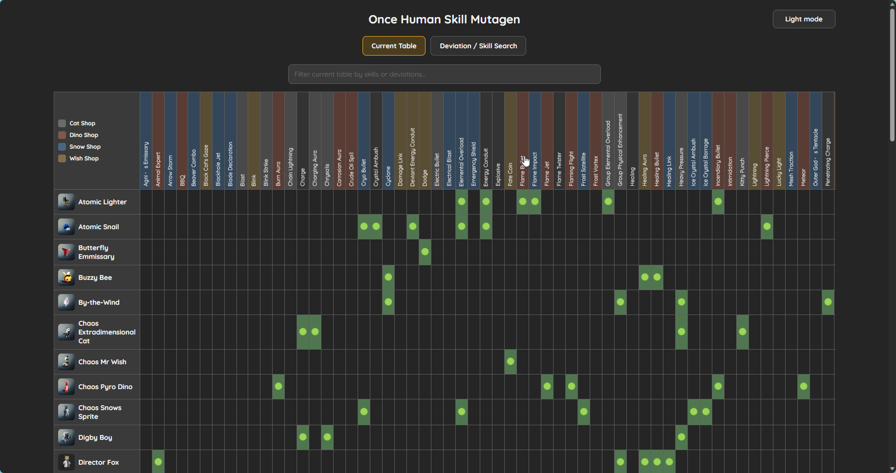
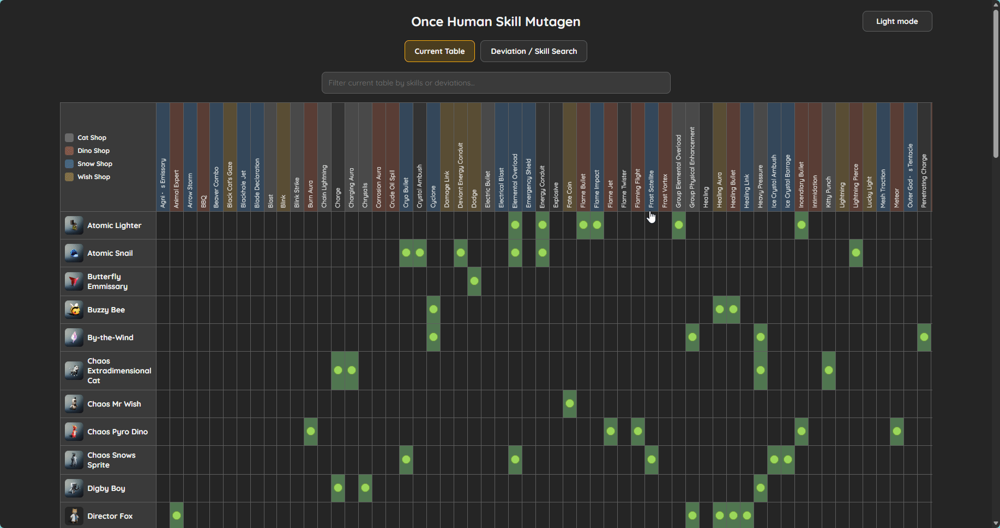
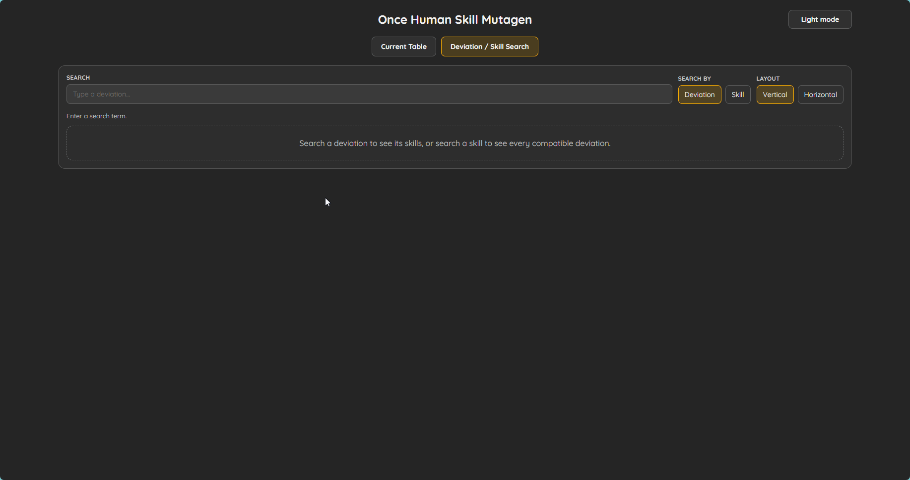

# Once Human Skill Mutagen

Once Human Skill Mutagen is a reference tool for mapping Deviations to compatible skill mutagens in *Once Human*.

Production site: **https://ohscp.saitohsmedia.com**

The public app is read-only and focuses on two views:

- **Current Table** — a full deviation x skill compatibility matrix with shop color-coding, table filtering, row/column highlighting, and dark/light themes.
- **Deviation / Skill Search** — a focused lookup tool for finding every skill on a deviation, or every deviation compatible with a skill.

Database editing is handled separately through a protected editor and Cloudflare D1 backend, so the public page stays clean.

## Screenshots

### Current Table — dark mode

The main table shows Deviations down the left side and skills across the top. Green cells mark compatible pairings, and the header colors identify the source shop.



### Current Table — light mode and table search

The table supports light mode and direct filtering by deviation or skill name, useful when checking a specific mutagen without leaving the matrix.



### Deviation / Skill Search

The search view lets you switch between deviation search and skill search. Deviation mode shows that deviation's skills; skill mode shows every compatible deviation and highlights matching/repeated skills.



## Features

- Dark and light mode with persisted preference.
- Shop legend and color-coded skill headers:
  - Cat Shop
  - Dino Shop
  - Snow Shop
  - Wish Shop
- Current Table filtering by skill or deviation.
- Clickable skill columns and deviation rows for quick highlighting.
- Deviation search with image-aware suggestions.
- Skill search with compatible deviations, repeated-skill highlighting, and clickable legend filters.
- Vertical and horizontal result layouts.
- Cloudflare Pages Functions + D1 backend for hosted database state.
- Protected `/dbeditor/` route for database editing.
- Protected `/keys/` route for generating and revoking edit keys.
- Static fallback data for local/offline use.

## Live routes

- Public app: https://ohscp.saitohsmedia.com
- Public app direct route: https://ohscp.saitohsmedia.com/Deviation-Skills
- Database editor: `/dbeditor/`
- Edit key admin: `/keys/`
- Terms: `/terms/`
- Privacy Policy: `/policy/`

## Credits

- Current Table design credit: [ayobad7](https://github.com/ayobad7)
- Once Human belongs to Starry Studio / NetEase. This is an unofficial fan-made tool.

## Cloudflare setup

```bash
# Requires CLOUDFLARE_API_TOKEN and CLOUDFLARE_ACCOUNT_ID in the environment.
npm install
npx wrangler d1 create oncehuman-skill-mutagen
```

Copy the returned `database_id` into `wrangler.toml`.

Seed the database:

```bash
npm run seed:remote
```

Optional: seed a first edit key at the same time:

```bash
SKILL_MUTAGEN_EDIT_KEY='<20-character-key>' npm run seed:remote
```

Set the Pages secret used by `/keys/` to generate/revoke editor keys:

```bash
npx wrangler pages secret put EDIT_KEYS_ADMIN_KEY --project-name once-human-skill-mutagen
```

Deploy to Cloudflare Pages:

```bash
npm run pages:deploy
```

## API

- `GET /api/database` — load the hosted deviation/skill database.
- `PUT /api/database` — save the database with `X-Edit-Key`.
- `GET /api/edit-keys` — list edit keys with `X-Admin-Key`.
- `POST /api/edit-keys` — generate edit keys with `X-Admin-Key`.
- `DELETE /api/edit-keys` — revoke edit keys with `X-Admin-Key`.

## Local development

```bash
npm install
npm run check
npm run pages:dev
```

The app can also be opened as static HTML, but Cloudflare-only routes and D1-backed saves require Pages Functions.
